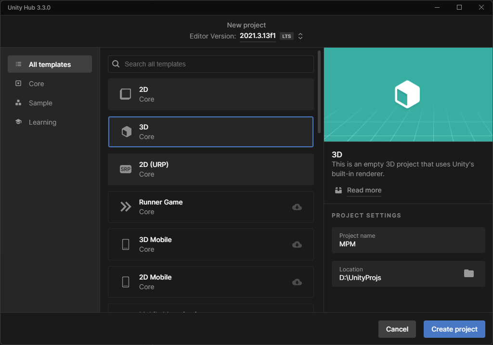

# Version Compatibility warnings

- If you are using Visual Studio 2022 17.4.x, there exists a compiler bug that doesn't allow it to compile projects for universal Windows Platform (UWP), used for Hololens 2 deployment. One can either downgrade to  Visual Studio 2022 17.3.x or ensure using a unity version which has the fix,i.e, Unity 2020.3.42f1, 2021.3.14f1, 2022.1.23f1, 2022.2.0b16 and 2023.1.0a19. The bug can be tracked on this [link](https://forum.unity.com/threads/workaround-for-building-with-il2cpp-with-visual-studio-2022-17-4.1355570/).

-  The Universal Render Pipeline for the 2021 LTS version has some perfomance issues at the time of writing this guide. The status of the known issue can be tracked from [this link](https://learn.microsoft.com/en-us/windows/mixed-reality/develop/unity/known-issues). We suggest using the built in render pipeline until the bug is fixed.

# Sample project output
[Play mode output for the sample project](images/SampleProjectOutput.mp4)

# Setup Instructions for a new project

 - Create a New Unity Project. The screenshot below shows a project with default 3D template.
 

 - Setup Microsoft Mixed Reaity Toolkit 3 (MRTK3) in your new project using the [official setup guide](https://learn.microsoft.com/en-us/windows/mixed-reality/mrtk-unity/mrtk3-overview/setup). The [sample project](/unity/) uses the shown MRTK3 packages and the Mixed Reality OpenXR Plugin.

- Setup the scene with MRTK XR Rig and MRTKInputSimulator prefabs and delete the default Main Camera in the scene. Enter the Unity play mode to verift that everything works fine. 

- Create a empty game object in the scene heirarcy from the context menu as shown in the screenshot.

- Name the newly created gameobject Mesh. Add Mesh Filter and Mesh Renderer components to the 
